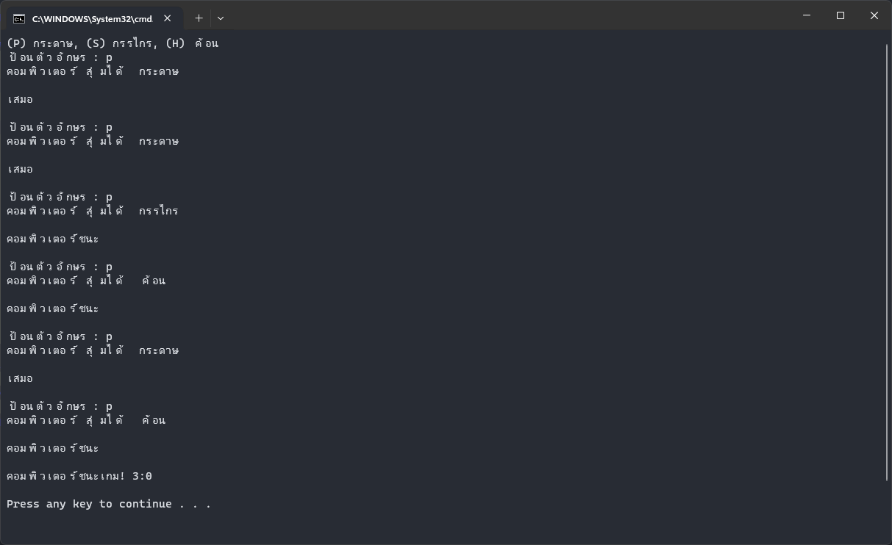

`1.py`<br>
สร้าง: 13 ก.พ. 2567 เวลา 11:39<br>
```py
from datetime import date


def display_birthdate(day, month, year):
    birthdate = date(year, month, day)
    formatted_date = birthdate.strftime("%d/%m/%Y")
    print("Your birthday is :", formatted_date)


display_birthdate(1, 1, 1999)

# NOTE: Output
# Your birthday is : 1/1/1999

```
`2.py`<br>
สร้าง: 13 ก.พ. 2567 เวลา 11:39<br>
```py
import datetime

birth_date = input("Enter your birth date (dd/mm/yyyy) : ")
day, month, year = map(int, birth_date.split("/"))
birth_date = datetime.date(year, month, day)

print("Your birthday is : ", birth_date)

# NOTE: Input
# Enter your birthday (dd/mm/yyyy) : 1/1/1999

# NOTE: Output
# Your birthday is : 1999-01-01

```
`3.py`<br>
สร้าง: 13 ก.พ. 2567 เวลา 11:39<br>
```py
import datetime

numbers = [int(num) for num in input("Enter Time (0 0 0) : ").split()[:3]]

if len(numbers) < 3:
    numbers += [0] * (3 - len(numbers))


def create_time(hours, minutes, seconds):
    time = datetime.time(hours, minutes, seconds)
    return time


print(f"Create Custom Time : {create_time(*numbers)}")

# NOTE: Input
# Enter Time (0 0 0) : 9 52 0

# NOTE: Output
# Create Custom Time : 09:52:00

```
`4.py`<br>
สร้าง: 13 ก.พ. 2567 เวลา 11:39<br>
```py
import math

number = float(input("กรุณาระบุตัวเลข: "))

sin_value = math.sin(number)
cos_value = math.cos(number)
tan_value = math.tan(number)

print(f"ค่า sin = {sin_value}")
print(f"ค่า cos = {cos_value}")
print(f"ค่า tan = {tan_value}")

# NOTE: Input
# กรุณาระบุตัวเลข: 14

# NOTE: Output
# ค่า sin = 0.9906073556948704
# ค่า cos = 0.1367372182078336
# ค่า tan = 7.2446066160948055

```
`5.py`<br>
สร้าง: 13 ก.พ. 2567 เวลา 11:39<br>


```py
import random

choices = {"p": "กระดาษ", "s": "กรรไกร", "h": "ค้อน"}
player_score = 0
computer_score = 0

print("(P) กระดาษ, (S) กรรไกร, (H) ค้อน")

while player_score < 3 and computer_score < 3:
    computer_choice = random.choice(list(choices.keys()))
    player_input = input("ป้อนตัวอักษร : ").lower()

    print("คอมพิวเตอร์สุ่มได้ ", choices[computer_choice])
    print()

    if choices[computer_choice] == choices[player_input]:
        print("เสมอ")
    elif choices[computer_choice] == "p" and choices[player_input] == "s":
        print("ผู้เล่นชนะ")
        player_score += 1
    elif choices[computer_choice] == "h" and choices[player_input] == "p":
        print("ผู้เล่นชนะ")
        player_score += 1
    elif choices[computer_choice] == "s" and choices[player_input] == "h":
        print("ผู้เล่นชนะ")
        player_score += 1
    else:
        print("คอมพิวเตอร์ชนะ")
        computer_score += 1
    print()

if player_score == 3:
    print(f"ผู้เล่นชนะเกม! {player_score}:{computer_score}")
else:
    print(f"คอมพิวเตอร์ชนะเกม! {computer_score}:{player_score}")
print()

```
