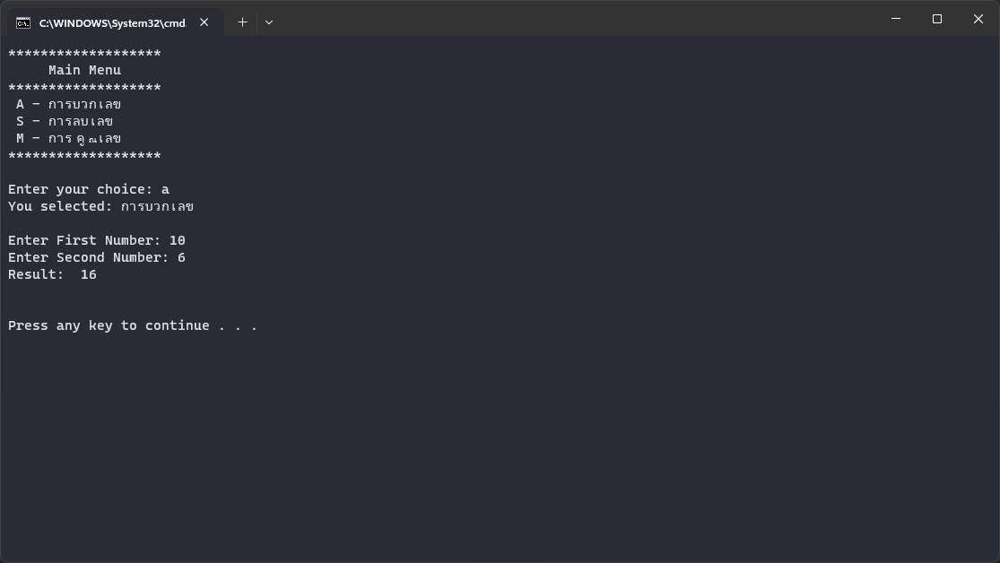
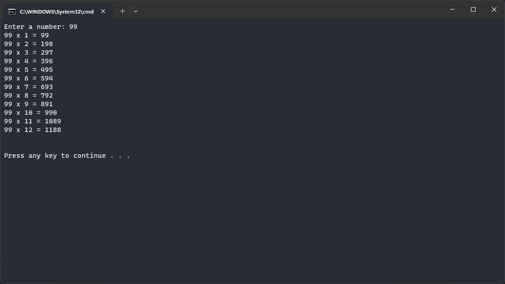
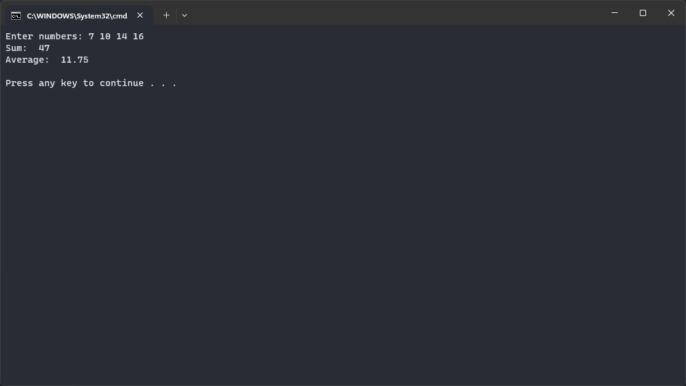

`1.py`<br>
สร้าง: 6 ก.พ. 2567 เวลา 10:57<br>
```py
def DisplayNumber(num):
    for i in range(1, num + 1):
        print(i)


DisplayNumber(1)

# NOTE: Output
# 1

```
`2.py`<br>
สร้าง: 6 ก.พ. 2567 เวลา 10:57<br>
```py
def SumNumber(number):
    sum = 0
    for i in range(1, number + 1):
        sum = sum + i
    print("ผลรวมของตัวเลข 1 ถึง %d เท่ากับ %d " % (number, sum))


SumNumber(5)

# NOTE: Output
# ผลรวมของตัวเลข 1 ถึง 5 เท่ากับ 15

```
`3.py`<br>
สร้าง: 6 ก.พ. 2567 เวลา 10:57<br>


```py
options = {"A": "การบวกเลข", "S": "การลบเลข", "M": "การคูณเลข"}


def add(number1, number2):
    return number1 + number2


def sub(number1, number2):
    return number1 - number2


def mul(number1, number2):
    return number1 * number2


def showMenu():
    print("*******************")
    print("     Main Menu     ")
    print("*******************")
    for key, value in options.items():
        print(f" {key} - {value}")
    print("*******************\n")


def createInputChoice():
    choice = input("Enter your choice: ")

    if choice.upper() in options:
        print(f"You selected: {options[choice.upper()]}\n")
        return choice.upper()
    else:
        print("Invalid choice! \n")


def createInputNumber():
    number1 = int(input("Enter First Number: "))
    number2 = int(input("Enter Second Number: "))
    return number1, number2


showMenu()
choice = createInputChoice()


if choice == "A":
    result = add(*createInputNumber())
    print("Result: ", result)
elif choice == "S":
    result = sub(*createInputNumber())
    print("Result: ", result)
elif choice == "M":
    result = mul(*createInputNumber())
    print("Result: ", result)

print("\n")

```
`4.py`<br>
สร้าง: 6 ก.พ. 2567 เวลา 10:57<br>
```py
def Add(number1, number2) -> None:
    sum = int(number1) + int(number2)
    print("ผลลัพธ์ของการบวกเลข เท่ากับ ", sum)


x = input("ป้อนตัวเลขที่ 1: ")
y = input("ป้อนตัวเลขที่ 2: ")

Add(x, y)

# NOTE: Input
# ป้อนตัวเลขที่ 1: 1
# ป้อนตัวเลขที่ 2: 1

# NOTE: Output
# ผลลัพธ์ของการบวกเลข เท่ากับ  2

```
`5.py`<br>
สร้าง: 6 ก.พ. 2567 เวลา 10:57<br>


```py
def multiplication_table(n):
    for i in range(1, 13):
        print(n, "x", i, "=", n * i)
    print("\n")


multiplication_table(int(input("Enter a number: ")))

```
`6.py`<br>
สร้าง: 6 ก.พ. 2567 เวลา 10:57<br>
```py
def fNum(num):
    if num % 2 == 0:
        print("เลขคู่")
    else:
        print("เลขคี่")


fNum(10)
# NOTE: Parameter 10
# Output เลขคู่

fNum(7)
# NOTE: Parameter 7
# Output เลขคี่

```
`7.py`<br>
สร้าง: 6 ก.พ. 2567 เวลา 10:57<br>
```py
def calculate_triangle_area(base, height):
    area = 0.5 * base * height
    return area


base = float(input("Enter base : "))
height = float(input("Enter height : "))

triangle_area = calculate_triangle_area(base, height)
print("The area is: ", triangle_area)

# NOTE: Input
# Enter base : 10
# Enter height : 10

# NOTE: Output
# The area is : 50.0

```
`8.1.py`<br>
สร้าง: 6 ก.พ. 2567 เวลา 10:57<br>
แก้ไขล่าสุด: เวลา 11:07<br>

```py
def sumA(*n) -> None:
    a = 0
    for x in n:
        a += x
    print(a)


sumA(3, 4, 12, 1)
sumA(10, 20, 30)

# NOTE: Output
# 20
# 60

```
`8.2.py`<br>
สร้าง: 6 ก.พ. 2567 เวลา 10:57<br>
แก้ไขล่าสุด: เวลา 11:07<br>

```py
def printkv(**kv):
    print(type(kv))
    print(kv)


printkv(name="Manaka Mukaido", age=14, sex="หญิง")

# NOTE: Output
# <class 'dict'>
# {'name': 'Manaka Mukaido', 'age': 14, 'sex': 'หญิง'}

```
`9.py`<br>
สร้าง: 6 ก.พ. 2567 เวลา 10:57<br>
แก้ไขล่าสุด: เวลา 11:29<br>



```py
def sumA(*n):
    a = 0
    for x in n:
        a += x
    return a


numbers = [int(num) for num in input("Enter numbers: ").split()]
result = sumA(*numbers)

print("Sum:", result)
print("Average:", result / len(numbers))
print()

```
`10.py`<br>
สร้าง: 6 ก.พ. 2567 เวลา 10:57<br>
แก้ไขล่าสุด: เวลา 11:29<br>

```py
def primeNum(num):
    if num % 2 == 0:
        return "เลขคู่"
    else:
        return "เลขคี่"


x = int(input("ป้อนตัวเลข: "))
result = primeNum(x)

print("ตัวเลขที่ป้อนเป็น ", result)

# NOTE: Input
# ป้อนตัวเลขที่ : 14

# NOTE: Output
# ตัวเลขที่ป้อนเป็นเลขคู่

```
`11.py`<br>
สร้าง: 6 ก.พ. 2567 เวลา 10:57<br>
แก้ไขล่าสุด: เวลา 11:07<br>

```py
def Tri(b, h):
    Area = 0.5 * b * h
    return Area


x = int(input("ป้อนตัวเลข: "))
y = int(input("ป้อนตัวเลข: "))
result = Tri(x, y)

print("พื้นที่สามเหลี่ยมเท่ากับ ", result)

# NOTE: Input
# ป้อนตัวเลข : 10
# ป้อนตัวเลข : 50

# NOTE: Output
# พื้นที่สามเหลี่ยมเท่ากับ 250.0

```
