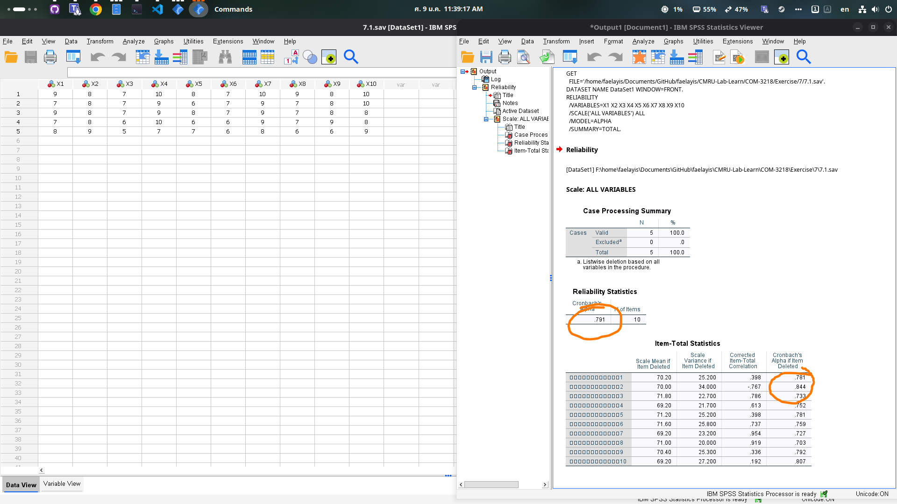
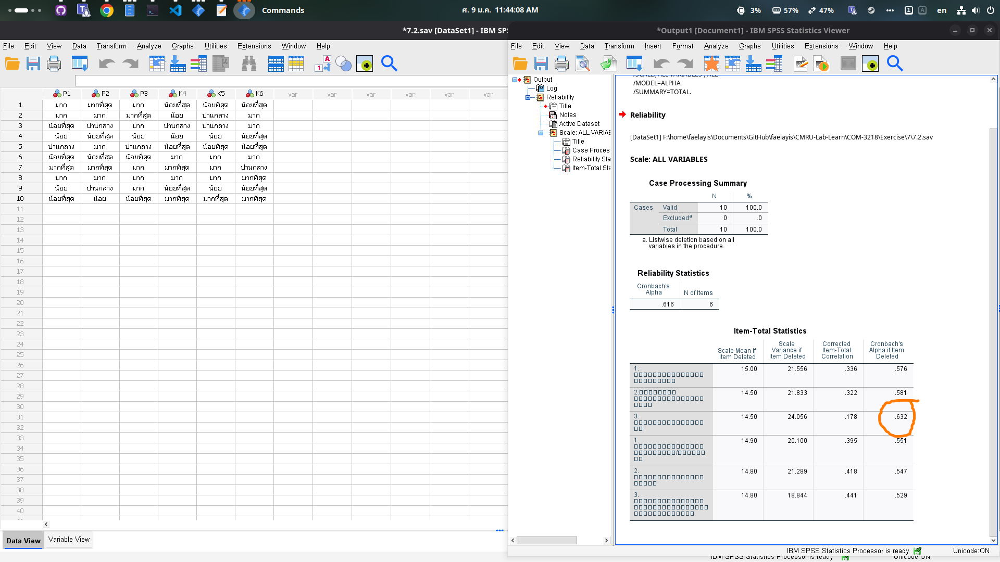

# 1. ในการแข่งขันประกวดร้องเพลงระดับประเทศ มีคณะกรรมการที่ให้คะแนน 10 คน และมีผู้เข้าแข่งขัน รอบสุดท้าย 5 คน จงตรวจลอบการให้คะแนนของกรรมการแต่ละท่านว่าสอดคล้องกันหรือไม่ โดยใช้วิธี  Cronbach's Apha และผลของกรรมการท่านใดควรตัดออก (กำหนดคะแนนสูงสุดที่คณะกรรมการจะให้กับผู้เข้าแข่งขันคือ 10 คะแนน) และผลการให้คะแนนเป็นดังนี้​

# ตัดคนที่ 2
# 2. แบบสอบถามเกี่ยวกับความประทับใจเกี่ยวกับสถาบันการศึกษาที่นักศึกษาเข้าศึกษาต่อและความกังวลเกี่ยวกับการเรียน​

# ตัดอาคารเรียนที่ 3 (p3)
