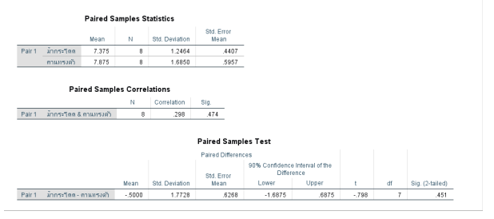

**1. ในการวัดคะแนนทดสอบความรู้ด้านคอมพิวเตอร์ของผู้สมัครงานจำนวน 20 คนได้ข้อมูลดังนี้**
50,62, 51, 41, 63, 56, 49, 67, 42, 57, 65, 68, 52, 43, 60, 70, 48, 69, 53 และ 61 จงทดสอบ
สมมติฐานว่าคะแนนเฉลี่ยเท่ากับ 60 คะแนนหรือไม่ และประมาณค่าแบบช่วงของคะแนนเฉลี่ยที่ระดับความเชื่อมั่น 95%

1. สมมติฐานที่ใช้ในการทดสอบ
H0 :   60 หรือ H0 : คะแนนเฉลี่ยเท่ากับ 60 คะแนน
H0 :   60 หรือ H0 : คะแนนเฉลี่ยเท่ากับ 60 คะแนน

2. ระดับนัยสำคัญ = 0.05
3. สถิติทดสอบ

4. ค่าสถิติ และเปรียบเทียบค่า Sig กับค่าระดับนัยสำคัญ
ค่า t = -1.765 ค่า 

5. สรุป
ค่า Sig. (2-tailed) = 0.094 มีค่ามากกว่า a = 0.05 แสดงว่ายอมรับ HO นั่นคือ: คะแนนเฉลี่ยเท่ากับ 60 คะแนนที่ระดับนัยสำคัญ .05
นอกจากนี้ผลวิเคราะห์ที่ได้จากโปรแกรม IBM SPSS Statistics ยังบอกค่าอื่นอีก คือค่าประมาณแบบ ช่วงของ ผลต่างของค่าเฉลี่ย ซึ่งก็คือ ช่วงความเชื่อมั่น (1-a)*100% ของ μ-μ1
นั่นคือ ช่วงความเชื่อมั่น 95% ของ µ-60 มีค่าระหว่าง -7.98 ถึง 0.68 หรือ -7.98 < μ – 60 <0.68 60-7.98 < mu < 60 + 0.68 หรือ ช่วงความเชื่อมั่น 95% ของ µ มีค่า 52.02 < μ <60.68

**2. ในการแข่งขันยิมนาสติกของนักกีฬา 8 คนที่ต้องเล่นกีฬา 2 อุปกรณ์ ได้แก่ ม้ากระโดด (Vaulting horse) และคานทรงตัว (Balance bars) ได้ผลคะแนนดังนี้**

| นักกีฬา คนที่ (Athlete No.)      | 1   | 2   | 3   | 4   | 5   | 6   | 7   | 8
| :-------------------------- | :-- | :-- | :-- | :-- | :-- | :-- | :-- | :-- |
| ม้ากระโดด (Vaulting Horse)    | 6.5 | 8.5 | 7.5 | 9.5 | 7.5 | 7.5 | 5.5 | 6.5 |
| คานทรงตัว (Balance Bars)     | 8.5 | 8.5 | 9.5 | 6.5 | 8.5 | 9.5 | 4.5 | 7.5 |

1. สมมติฐานที่ใช้ในการทดสอบ
H0 :   0 หรือ H0 : คะแนนเฉลี่ยของกีฬาทั้งสองอุปกรณ์ ไม่มีความสัมพันธ์กัน
H0 :   0 หรือ H0 : คะแนนเฉลี่ยของกีฬาทั้งสองอุปกรณ์ มีความสัมพันธ์กัน

2. ระดับนัยสำคัญ = 0.10
3. สถิติทดสอบ

4. ค่าสถิติ และเปรียบเทียบค่า Sig กับค่าระดับนัยสำคัญ
ค่า t =  - 0.798  และค่า Sig = 0.451 มีค่ามากกว่า  = 0.10

5. สรุป
Sig. (Correlation) = 0.474 มีค่ามากกว่า a = 0.1 นั่นคือ ยอบรับ HO นั่นคือ คะแนนเฉลี่ยของกีฬาทั้ง สองอุปกรณ์ไม่มีความสัมพันธ์กัน ที่ระดับนัยสำคัญ 10

1. สมมติฐานที่ใช้ในการทดสอบ
H0 :   0 หรือ H0 : คะแนนเฉลี่ยของกีฬาทั้งสองอุปกรณ์ ไม่มีความแตกต่าง
H0 :   0 หรือ H0 : คะแนนเฉลี่ยของกีฬาทั้งสองอุปกรณ์ มีความแตกต่าง

2. ระดับนัยสำคัญ = 0.10
3. สถิติทดสอบ

4. ค่าสถิติ และเปรียบเทียบค่า Sig กับค่าระดับนัยสำคัญ
ค่า t =  - 0.798  และค่า Sig = 0.451 มีค่ามากกว่า  = 0.10

5. สรุป
Sig. (Correlation) = 0.451 มีค่ามากกว่า a = 0.1 นั่นคือ ยอบรับ HO นั่นคือ คะแนนเฉลี่ยของกีฬาทั้ง
สองอุปกรณ์ไม่แตกต่างกัน 

