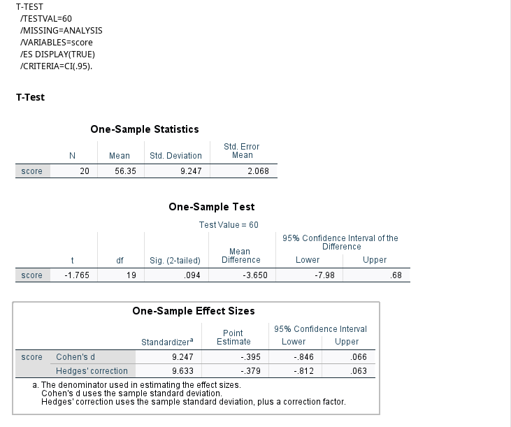
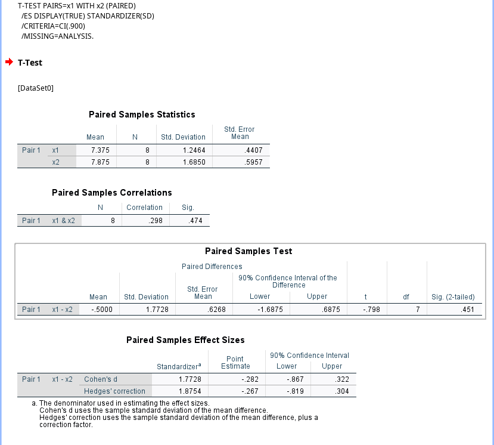

**1. ในการวัดคะแนนทดสอบความรู้ด้านคอมพิวเตอร์ของผู้สมัครงานจำนวน 20 คนได้ข้อมูลดังนี้**
50,62, 51, 41, 63, 56, 49, 67, 42, 57, 65, 68, 52, 43, 60, 70, 48, 69, 53 และ 61 จงทดสอบ
สมมติฐานว่าคะแนนเฉลี่ยเท่ากับ 60 คะแนนหรือไม่ และประมาณค่าแบบช่วงของคะแนนเฉลี่ยที่ระดับความเชื่อมั่น 95%

1. การตั้งสมมติฐานในการทดสอบ
Ηο: μα = 60 หรือ เฉลี่ยเท่ากับ 60 คะแนน
Ηο: μα ≠ 60 หรือ เฉลี่ยเท่ากับ 60 คะแนน

2. กำหนดระดับนัยสำคัญ
A = .094

**2. ในการแข่งขันยิมนาสติกของนักกีฬา 8 คนที่ต้องเล่นกีฬา 2 อุปกรณ์ ได้แก่ ม้ากระโดด (Vaulting horse) และคานทรงตัว (Balance bars) ได้ผลคะแนนดังนี้**

| นักกีฬา คนที่ (Athlete No.)      | 1   | 2   | 3   | 4   | 5   | 6   | 7   | 8
| :-------------------------- | :-- | :-- | :-- | :-- | :-- | :-- | :-- | :-- |
| ม้ากระโดด (Vaulting Horse)    | 6.5 | 8.5 | 7.5 | 9.5 | 7.5 | 7.5 | 5.5 | 6.5 |
| คานทรงตัว (Balance Bars)     | 8.5 | 8.5 | 9.5 | 6.5 | 8.5 | 9.5 | 4.5 | 7.5 |

