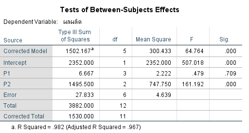
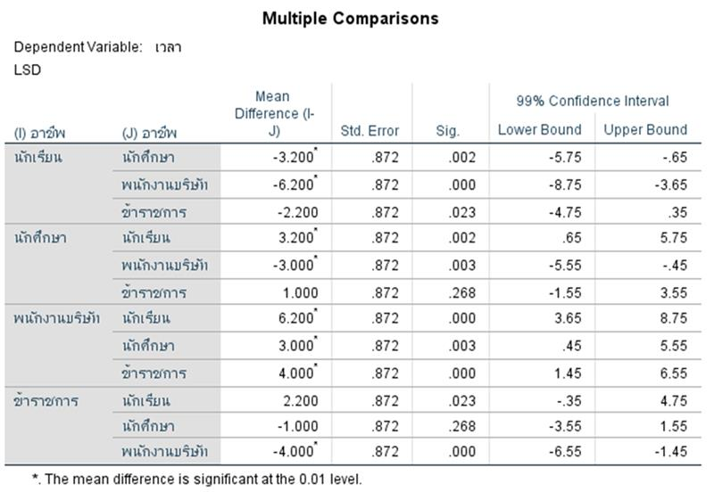

2. ถ้าต้องการเปรียบเทียบประสิทธิภาพของปุ๋ย 3 ชนิด (ก, ข, ค) จึงทดลองโดยสุ่มพื้นที่มา 4 แห่ง แล้วแบ่งแต่ละพื้นที่เป็น 3 ส่วน ในแต่ละพื้นที่จะกำหนดชนิดของปุ๋ยอย่างสุ่ม ได้ข้อมูลดังนี้

2.1 จงทดสอบว่าปุ๋ยทั้ง 3 ชนิดมีประสิทธิภาพที่แตกต่างกันหรือไม่ ให้ระดับนัยสำคัญ 0.10

1. สมมติฐานที่ใช้ในการทดสอบ
ทดสอบชนิดปุ๋ย
H0 :  1   2  =  3 หรือประสิทธิภาพของปุ๋ยทั้ง 3 ชนิดไม่แตกต่างกัน
H1 : มีปุ๋ยอย่างน้อย 1 ยี่ห้อที่มีประสิทธิภาพแตกต่างจากข้ออื่น 
พื้นที่ปลูก
H0 :  1   2  =  3 หรือประสิทธิภาพของพื้นที่ทั้ง 4 พื้นที่ไม่แตกต่างกัน
H1 : มีพื้นที่อย่างน้อย 1 พื้นที่มีประสิทธิภาพแตกต่างจากข้ออื่น 

2. ระดับนัยสำคัญ = 0.10
3. สถิติทดสอบ

4.ค่าสถิติ และเปรียบเทียบค่า Sig กับค่าระดับนัยสำคัญ

ทดสอบชนิดปุ๋ย
ค่า  F = 161.192 และค่า Sig = 0.000 มีค่าน้อยกว่า  = 0.10
พื้นที่ปลูก
ค่า  F = 0.479 และค่า Sig = 0.709 มีค่าน้อยกว่า  = 0.10

5.สรุป
ค่า  F = 161.192 และค่า Sig = 0.000 มีค่าน้อยกว่า  = 0.10

2.2.จงทดสอบว่าพื้นที่ทั้ง 4 ส่วนให้ผลผลิตไม่แตกต่างกัน ที่ระดับนัยสำคัญ 0.10

3.ในการทดสอบสมมติฐานว่า "อาชีพใดที่ใช้เวลากับเครื่องคอมพิวเตอร์มากที่สุด" จากข้อมูลต่อไปนี้ 

ตอบ พนักงานบริษัทมีระยะเวลากับเครื่องคอมพิวเตอร์มากที่สุด
