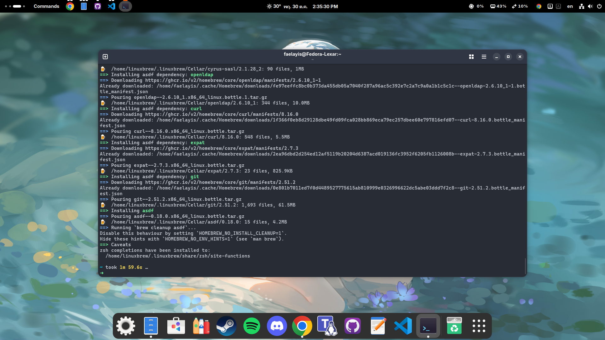
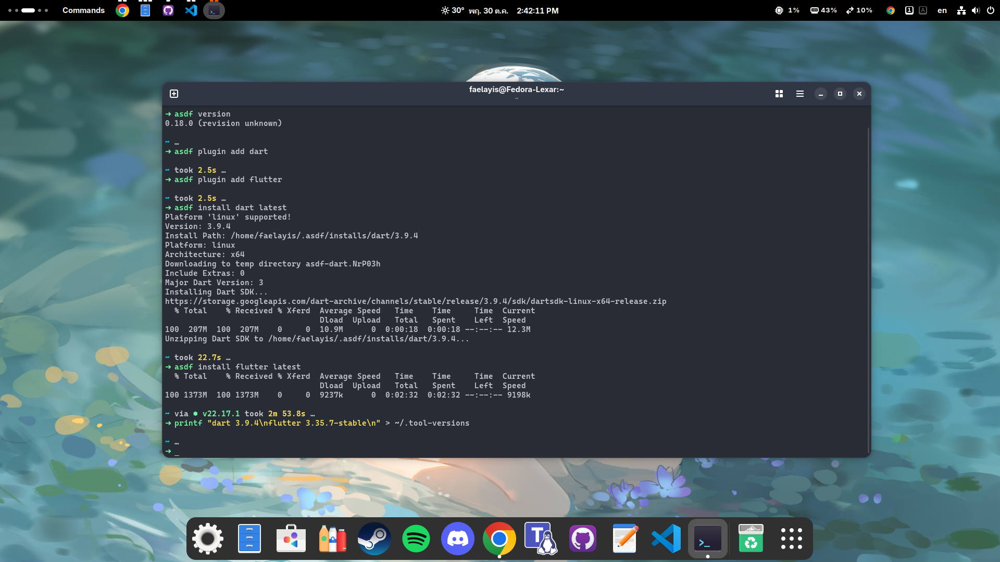
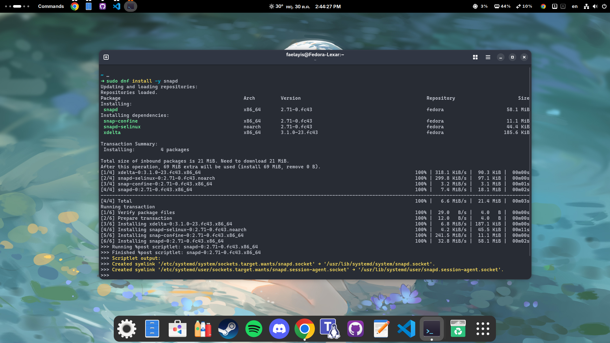
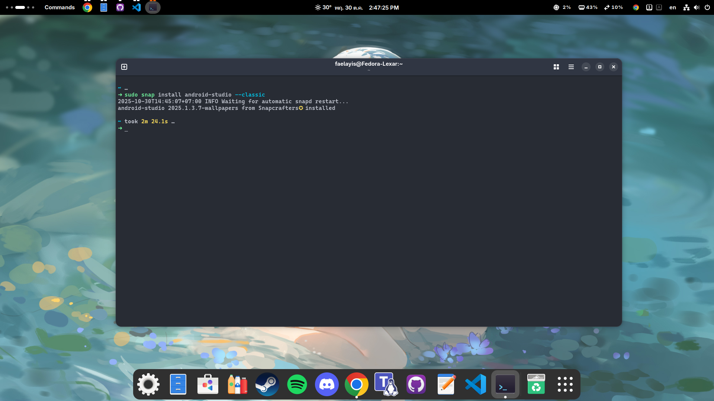
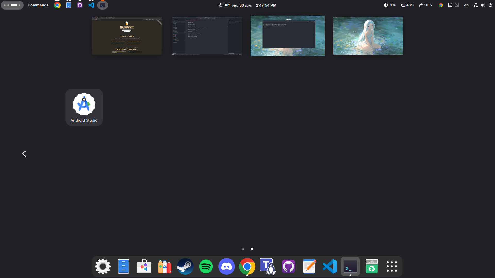
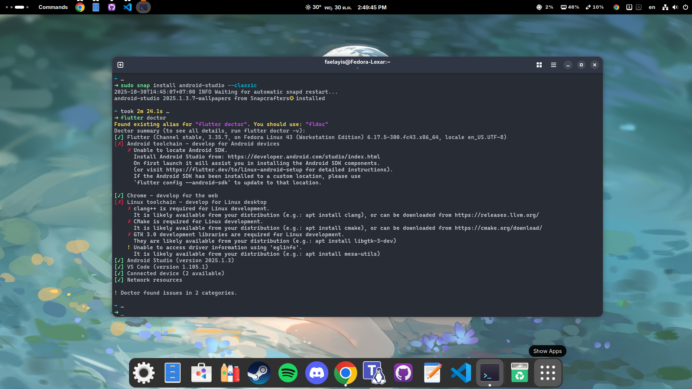
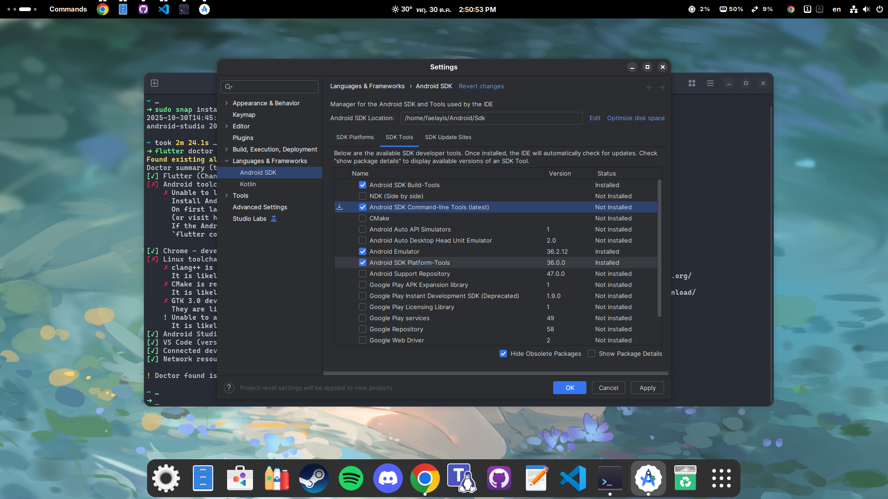
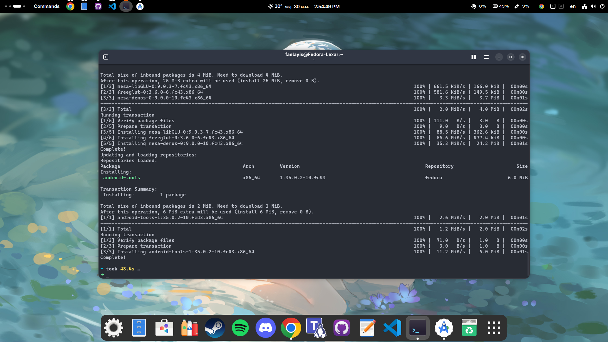
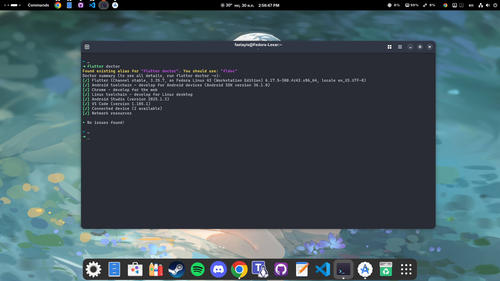
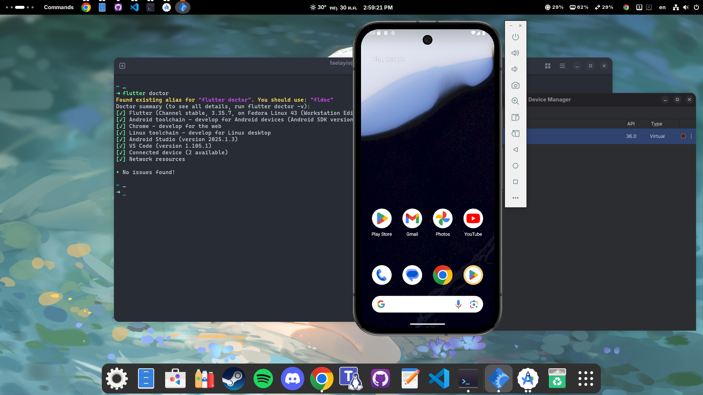

## Setup (Fedora Linux)

<!-- prettier-ignore -->
> [!WARNING]
> คำแนะนำนี้เขียนไว้สำหรับ **Fedora Linux** เท่านั้น<br>
> ถ้าใช้ distro อื่นเช่น Ubuntu, Arch, Debian คำสั่งอาจจะต่างกัน<br>
> (เช่น `dnf` ใน Fedora = `apt` ใน Ubuntu)<br>
> *ถ้าใช้ distro อื่นแนะนำให้หา guide เฉพาะของ distro นั้นๆ*
>

### ติดตั้ง [Homebrew](https://brew.sh/)

เอาไว้จัดการ package บน linux แบบง่ายๆ

`/bin/bash -c "$(curl -fsSL https://raw.githubusercontent.com/Homebrew/install/HEAD/install.sh)"`


### ติดตั้ง [asdf](https://asdf-vm.com/)

ตัวจัดการ version ของภาษาต่างๆ เอาไว้เปลี่ยน version Dart/Flutter ได้สะดวก

```bash
brew install asdf
```



### เพิ่ม [plugin](https://github.com/asdf-vm/asdf-plugins?tab=readme-ov-file#plugin-list) สำหรับ [Dart](https://github.com/PatOConnor43/asdf-dart) และ [Flutter](https://github.com/asdf-community/asdf-flutter)

```bash
asdf plugin add dart
asdf plugin add flutter

# ติดตั้ง Dart และ Flutter version ล่าสุด

asdf install dart latest
asdf install flutter latest

# ตั้งค่า version ที่จะใช้เป็นค่า default
printf "dart 3.9.4\nflutter 3.35.7-stable\n" > ~/.tool-versions
```



### ติดตั้ง [Android Studio](https://snapcraft.io/android-studio) (snap)

<!-- prettier-ignore -->
> [!WARNING]
> ทางเลือกสามารใช้ [Android Studio](https://flathub.org/en/apps/com.google.AndroidStudio) บน flathub ได้<br>
> *แต่ต้องกำหนด permissions เยอะหน่อย :/*
>

เอาไว้ใช้ emulator android และเครื่องมือสำหรับพัฒนา

```bash
sudo dnf install -y snapd
sudo snap install android-studio --classic
```





### ตรวจสอบว่าติดตั้งครบหรือยัง

```bash
flutter doctor
```



แก้ให้ doctor ผ่าน



#### Android toolchain - develop for Android devices

ต้อง accept license ของ Android SDK ก่อนถึงจะใช้งานได้

```bash
flutter doctor --android-licenses
```


#### Linux toolchain - develop for Linux desktop

ติดตั้ง [package](https://docs.flutter.dev/platform-integration/linux/setup) ที่จำเป็นสำหรับ compile app บน fedora

```bash
sudo dnf install -y gcc make kernel-devel
sudo dnf install -y gtk3-devel
sudo dnf install -y egl-utils
sudo dnf install -y mesa-demos
sudo dnf install -y clang
sudo dnf install -y cmake
sudo dnf install -y android-tools
```




### เสร็จสิ้น 🎉



<div align="center"><a href="#"></a></div>
